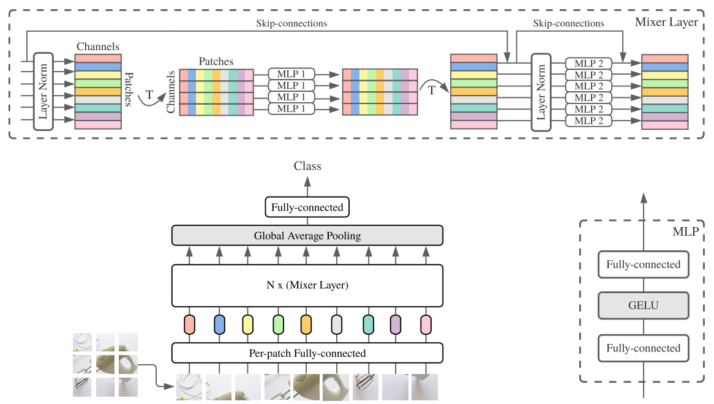
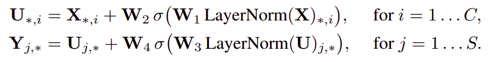

# MLP-Mixer-PyTorch
An all MLP architecture for Computer Vision by Google (May'2021)
> **MLP-Mixer: An all-MLP Architecture for Vision.** <br> Ilya Tolstikhin, Neil Houlsby, Alexander Kolesnikov, Lucas Beyer, Xiaohua Zhai, Thomas Unterthiner, Jessica Yung, Andreas Steiner, Daniel Keysers, Jakob Uszkoreit, Mario Lucic, Alexey Dosovitskiy

**Going back from where we started.**  
In this paper the authors have shown that while convolutions(CNNs) and attention(Vision Transformers) are both sufficient for good performance, neither of them are necessary. 

The idea behind the Mixer architecture is to clearly separate 
- the per-location (channel-mixing) operations and
- cross-location or per-features (token-mixing) operations.

Both operations are implemented with MLPs.

## Architecture
<p align = "center">

</p>

MLP-Mixer contains two types of layers: one with MLPs applied independently to
image patches (i.e. “mixing” the per-location features), and one with MLPs applied across patches (i.e. “mixing” spatial information).

MLP-Mixer consists of per-patch linear embeddings, Mixer layers, and a classifier head. Mixer layers contain one token-mixing MLP and one channel-mixing MLP, each consisting of two fully-connected layers and a GELU nonlinearity. 

Other components include: skip-connections, dropout, layer norm on the channels, and linear classifier head.

The Mixer layer can be written as follows in matrix multiplication form:
<p align="center"></p>


Here σ is an element-wise nonlinearity (GELU).

## Run Locally
Clone the repository
```bash
git clone https://github.com/lavish619/MLP-Mixer-PyTorch.git
```
Change Directory
```bash
cd MLP-Mixer-PyTorch
```
Run mlp_mixer.py
```bash
python mlp_mixer.py
```
or start using the model by
```python
from mlp_mixer import MLP_Mixer

# Default Parameters for S/16 Model as given in paper
model = MLP_Mixer(image_shape=(224,224,3), 
                  patch_size = 16,
                  num_classes=10, 
                  num_mixers=8, 
                  num_features=512,
                  expansion_token=4,
                  expansion_channel=0.5, 
                  dropout=0.5)
```

## Citations
```
@article{tolstikhin2021,
  title={MLP-Mixer: An all-MLP Architecture for Vision},
  author={Tolstikhin, Ilya and Houlsby, Neil and Kolesnikov, Alexander and Beyer, Lucas and Zhai, Xiaohua and Unterthiner, Thomas and Yung, Jessica and Keysers, Daniel and Uszkoreit, Jakob and Lucic, Mario and Dosovitskiy, Alexey},
  journal={arXiv preprint arXiv:2105.01601},
  year={2021}
}
```
## References
- [Arxiv Link (Paper)](https://arxiv.org/abs/2105.01601)
- [Medium Article](https://medium.com/@nabil.madali/an-all-mlp-architecture-for-vision-7e7e1270fd33)
